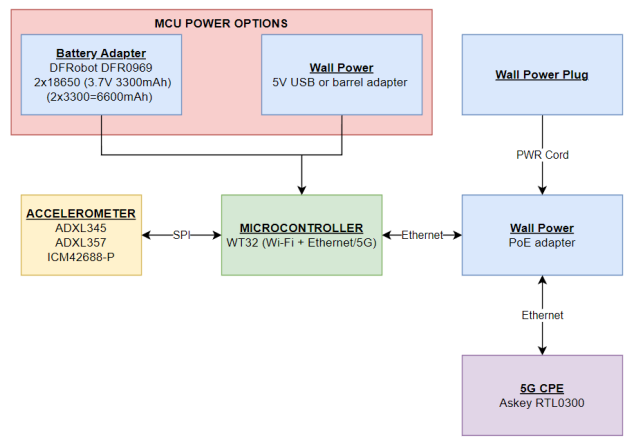
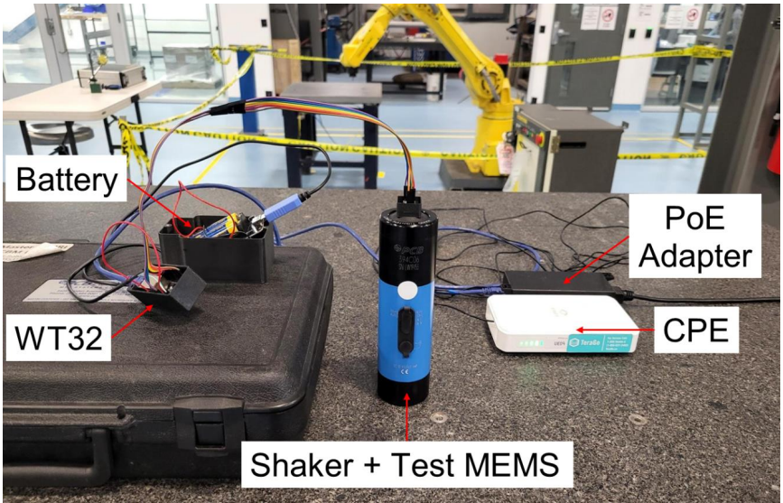
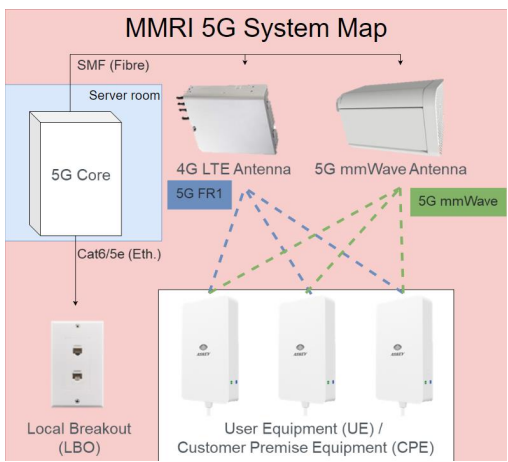
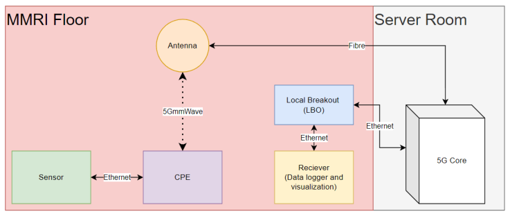

# Hardware
- My sensor (Diagram)
	- 
- My sensor (On shaker)
	- 
## 5G Connection
- Sensor connects to 5G via ethernet CPE access point
- Connects to a device connected directly to the 5G core server
	- This port is connected to an ethernet port in the lab, the local breakout port (LBO)

## MCU
- WT32 - all important info below
	- https://github.com/egnor/wt32-eth01 (Guide)
		- most helpful for setup, tricks for WT32
		- HOW TO PROGRAM -> program mode vs run mode (IO0)
	- https://en.wireless-tag.com/product-item-2.html (INFO)

## Accelerometer
All read via SPI (analog sensor add ADC)
- ICM42688-P
	- Custom PCB (datasheet pg. 21 typical operating circuit)
		- Included in files
		- Easy for me to order more, just contact me
	- https://invensense.tdk.com/products/motion-tracking/6-axis/icm-42688-p/ (INFO)
	- https://invensense.tdk.com/wp-content/uploads/2020/04/ds-000347_icm-42688-p-datasheet.pdf (DATASHEET)
# Software
## Libraries
All info based on register functions from accelerometer datasheets
- ICM42688-P
	- mainly based on https://github.com/finani/ICM42688
	- some changes to try to make SPI reads faster and match some functions to my other accelerometer libraries
	- did some work to get FIFO working to try for 32 kHz output
	- tested and working with 5G and ethernet at 16kHz ODR with interrupt method
## Platformio/ESP32
- Used for code uploading 
	- https://randomnerdtutorials.com/vs-code-platformio-ide-esp32-esp8266-arduino/
		- GOOD GUIDE - platformio for esp32 install and setup
	- https://platformio.org/install
	- https://docs.platformio.org/en/latest/boards/espressif32/wt32-eth01.html?utm_source=platformio&utm_medium=piohome
		- WT32 board setup (select for board in platformio)
## Receiver
- Require python and matplotlib library (rest of libraries should be built in)
# Setup
- Follow platformio setup
- Setup WT32 for programming per the guide
- Code should be okay to upload to sensor
	- sensor
		- set IP address and port number of receiver 
	- receiver
		- match port number to sensor
- Change to run mode and connect to a python reader
## FOR SENSOR
- Needs valid network info (reader IP address and port)
- Sensor settings for Hz and range are set via code still I think for ICM, controls need to be finished
- 16kHz max ODR for SPI without FIFO right now
## FOR RECEIVER
- Needs port set for same as reader 
- Needs sensor on and running first
# Lathe Tool Holder Previous Works
- Bleicher 2018, 2020, 2023 (Milling)
  	- Schorghofer 2019
	- Ramsauer 2021 (not much sensor info added here)
## Main Changes
- Mounting (tool holder)
	- machine considerations (chips, coolant, heat)
	- cpe placement / battery life
- Read selected sensors
- Rec./Controller updates + database implementation
- Sensor connection / reconnection handling
